# Project Description

As presented on its official [Github repository](https://github.com/ROCmSoftwarePlatform/rocALUTION), "rocALUTION is a sparse linear algebra library with focus on exploring fine-grained parallelism [...], targeting modern CPU and GPU platforms". The library is easy to build on Linux systems. However, this process is a little bit more complex on Windows. In this project, I present all the steps required for building rocALUTION on Windows with OpenMP backend.

## The Library

rocALUTION offers four different backends: host, [OpenMP](https://www.openmp.org/) for multicore CPUs, [HIP](https://github.com/ROCm-Developer-Tools/HIP) designed for ROCm compatible devices (currently available only on Linux systems) and [MPI](https://www.open-mpi.org/) for multi-node clusters. As detailed in [rocALUTION documentation](https://rocalution.readthedocs.io/en/master/), the library offers multiple iterative solvers, preconditioners and handles different sparse matrix storage formats:

### Iterative Solvers

1. Fixed-Point iteration schemes - Jacobi, (Symmetric) Gauss-Seidel, SOR, SSOR
2. Krylov subspace methods - CR, CG, BiCGStab, BiCGStab(l), GMRES, IDR, QMRCGSTAB, Flexible CG/GMRES
3. Mixed-precision defect-correction scheme
4. Chebyshev iteration scheme
5. Multigrid - geometric and algebraic

### Preconditioners

1. Matrix splitting schemes - Jacobi, (multi-colored) (symmetric) Gauss-Seidel, SOR, SSOR
2. Factorization schemes - ILU(0), ILU(p) (based on levels), ILU(p,q) (power(q)-pattern method), multi-elimination ILU (nested/recursive), ILUT (based on threshold), IC(0)
3. Approximate Inverses - Chebyshev matrix-valued polynomial, SPAI, FSAI, TNS
4. Diagonal-based preconditioner for Saddle-point problems
5. Block-type of sub-preconditioners/solvers
6. (Restricted) Additive Schwarz
7. Variable type of preconditioners

### Sparse matrix formats

1. Compressed Sparse Row (CSR)
2. Modified Compressed Sparse Row (MCSR)
3. Dense (DENSE)
4. Coordinate (COO)
5. The Ellpack-Itpack (ELL)
6. Diagonal (DIA)
7. Hybrid ELL and COO (HYB)

## Prerequisites

To build rocALUTION on Windows with OpenMP backend, three software tools are required: CMAKE, GIT and a compiling toolchain.

1. [CMAKE](https://cmake.org/download/): the release 3.5+ is required. Older releases might not work.
2. [GIT](https://git-scm.com/download/win)
3. Building toolchain: we will use MSVC included in [Microsoft Visual Studio 2019](https://visualstudio.microsoft.com/vs/community/). The MVS 2017 and 2015 will work as well.

## Build Process

Explain what these tests test and why

### Getting Started

The first step is to download and install CMAKE, Git and Microsoft Visual Studio 2019.

### Download rocALUTION

The rocALUTION code can be downloaded in two ways:

1. Use Git commands:
```bash
git clone https://github.com/ROCmSoftwarePlatform/rocALUTION.git
```
2. Download the solution as a zipped file:

* Go to [rocALUTION repository](https://github.com/ROCmSoftwarePlatform/rocALUTION)
* Click on "Clone or download", then click on "Download ZIP"
* Unzip the file to a folder of your choice

After download rocALUTION code, rename the folder "*rocALUTION-develop*" to "*rocalution*". Then, change directory to "*rocalution*"and create a directory "*build*" in the current folder.

## Use CMAKE to Configure the Project

1. Open CMAKE
2. Copy the rocalution root folder path to the "source code" text field of CMAKE
3. Copy the rocalution build folder path to the "build the binaries" text field of CMAKE
4. Click the button "Configure" (see Figure 1)
5. A window pops up asking for:
    * Generator (select Visual Studio 16 2019) if you want to build a library for the latest releases of MSVC tools
    * Optionally, you can select the target platform (by default: x64)
    * Once the configuration process is done, make sure that the "SUPPORT_OMP" flag is checked
6. Press the button "Generate"

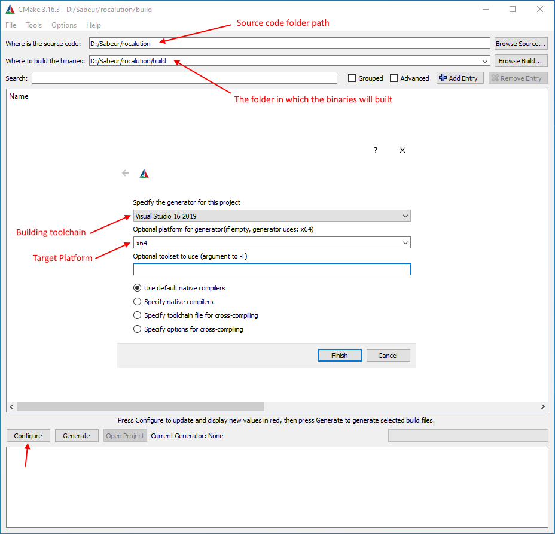<br/>
*Figure 1. Configure project using CMAKE*

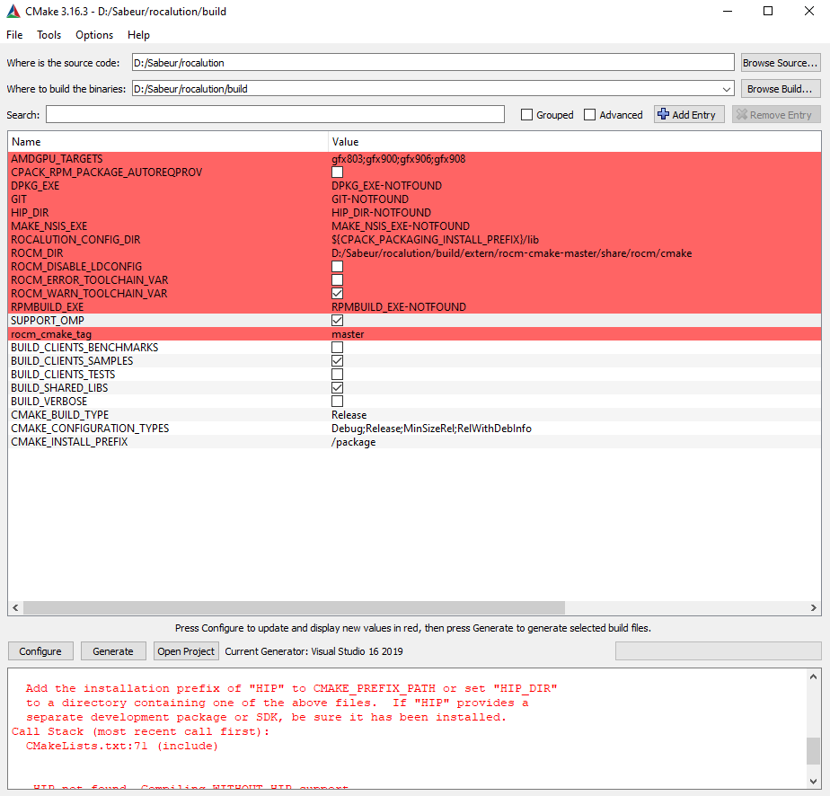<br/>(a)<br/>
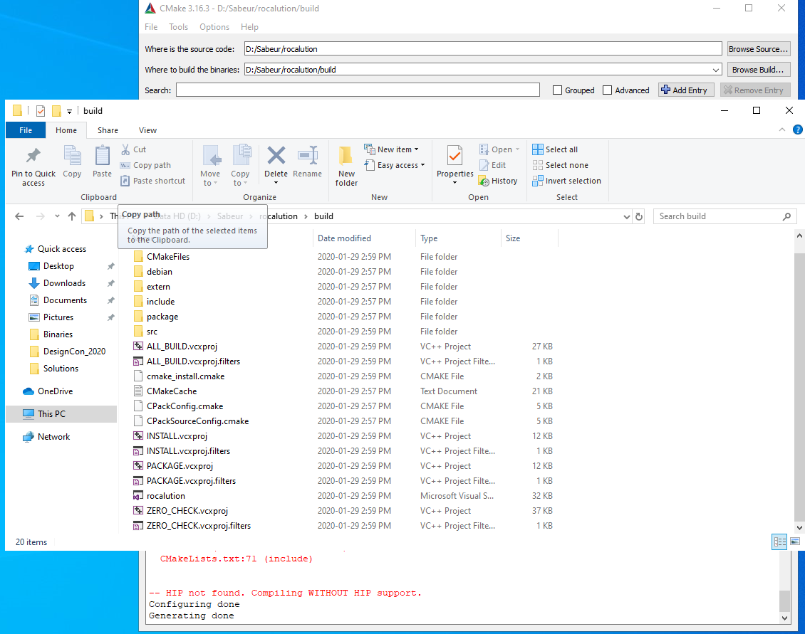<br/>(b)<br/>
*Figure 2. Generate visual studio project using CMAKE: (a) Make sure that the "SUPPORT_OMP" flag is checked before clicking "Generate" (b) Once project generation is done, notice the visual studio solution and projects files added to the folder*

## Compile the Visual Studio Solution

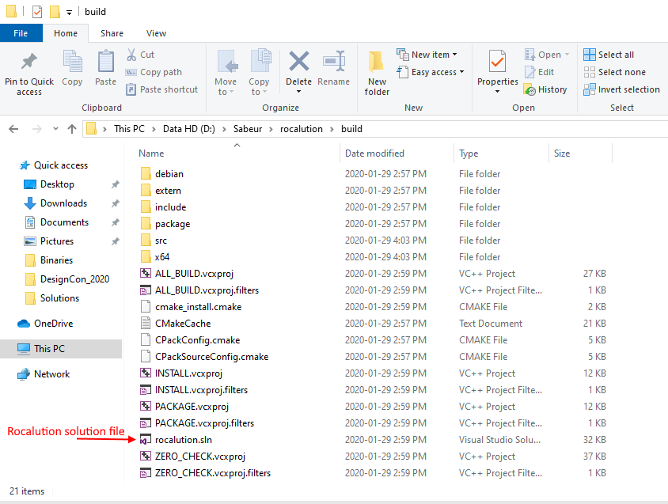<br/>
*Figure 3. Generated visual studio solution*

1. Open the "build" directory
2. Open the Visual Studio solution by double clicking the file "rocalution.sln" (see Figure 3)
3. Once the solution is opened in Microsoft Visual Studio IDE, the rocalution projects are listed in the Solution Explorer (see Figure 4)

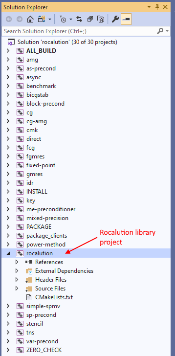<br/>
*Figure 4. Rocalution solution projects*

## Compile Rocalution Library

1. In the solution explorer, right-click on “rocalution” project and click “Build” (Notice that the default build is Debug and default platform is x64).
* You might get the error **"C2065 'M_PI': undeclared identifier"** (see Figure 5). This refers to the variable **M_PI** in *line 430* of the file *host_vector.cpp*. This variable appears only once in that file and project. To solve this error, just add this line to the beginning of the function *"double M_PI = 3.141592653589793238;"* (e.g., line 420), then rebuild the project.

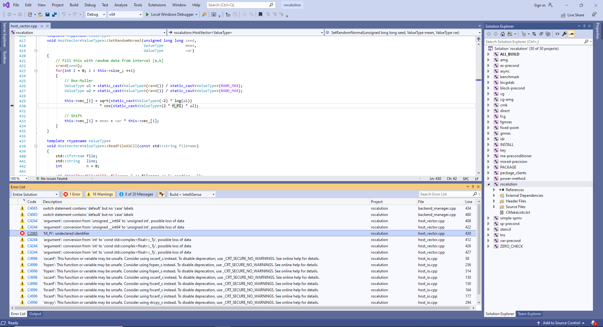<br/>
*Figure 5. Potential compilation error*

Once this error is corrected, the *rocalution* project can be built as a shared library.

### Build Release Version

1. Select "**Release**" in the configuration dropdown list.
2. Right-click on "**rocalution**" project and then click on "**Properties**".
3. In the "**General**" tab, select "**Static Library (.lib)**" in the "**Configuration Type**" (see Figure 6).
4. In the "**Advanced**" tab, make sure that the "**Target File Extension**" is "**.lib**" (see Figure 7).
5. Under "**C/C++**" and "**Optimization**" tab, make sure that "**Optimization**" is set to "**Maximum Optimization (Favor Speed) (/O2)**" (see Figure 8).
6. Under "**C/C++**" and "**Code Generation**" tab, make sure that "**Runtime Library**" is set to "**Multi-threaded (/MT)**" (see Figure 9).
7. Under "**C/C++**" and "**Language**" tab, make sure that "**Open MP Support**" is set to "**Yes (/openmp)**" (see Figure 10).
8. Click "**OK**". Then, rebuild the project.
The output library will be stored under "**[PATH]\rocalution\build\src\Release\rocalution.lib**" (see Figure 11).

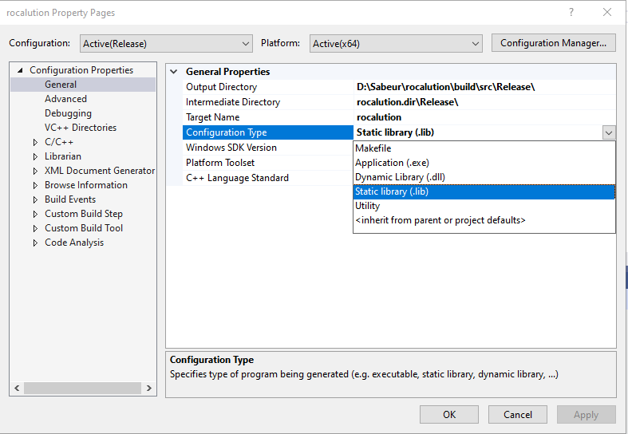<br/>
*Figure 6. Select static library*

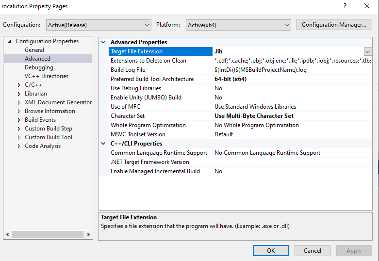<br/>
*Figure 7. Set target file extension to ".lib"*

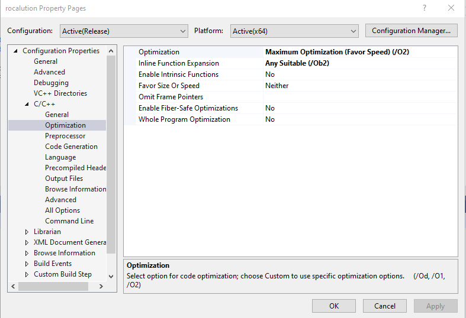<br/>
*Figure 8. Select maximum optimization*

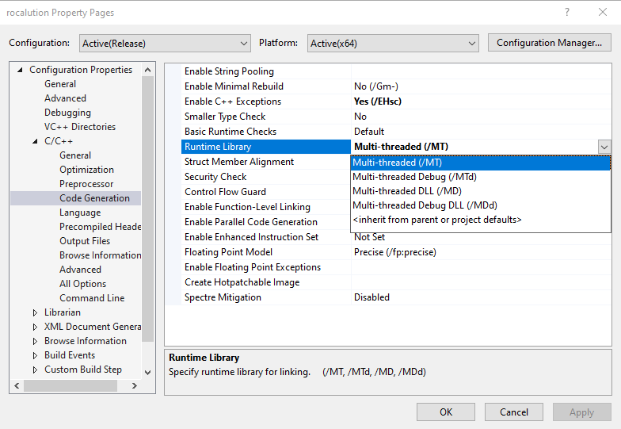<br/>
*Figure 9. Select runtime library type*

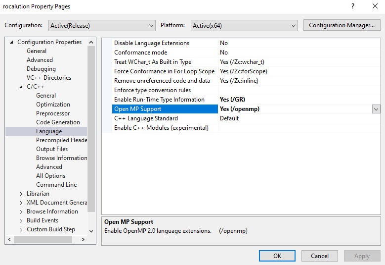<br/>
*Figure 10. Set OpenMP support*

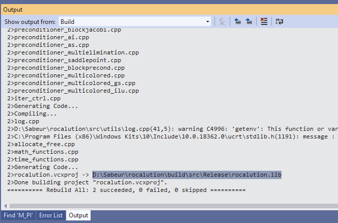<br/>
*Figure 11. The release version of the library is saved to "build/src/Release"*

### Build Release Version With Debug Info version

In addition to the steps taken for "*Release*" version, add the following:

1. Select "**RelWithDebInfo**" in the configuration dropdown list.
2. Under "**C/C++**" and "**General**" tab, make sure that "**Debug Information Format**" is set to "**Program Database (/Zi)**" (see Figure 12).
The building process generates two files ('.lib' and '.pdb') which are stored under "**[PATH]\rocalution\build\src\RelWithDebInfo\rocalution.lib**" (see Figure 13). 
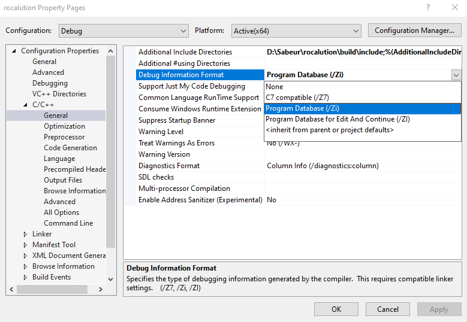<br/>
*Figure 12. Enable program database flag to generate '.pdb' files*

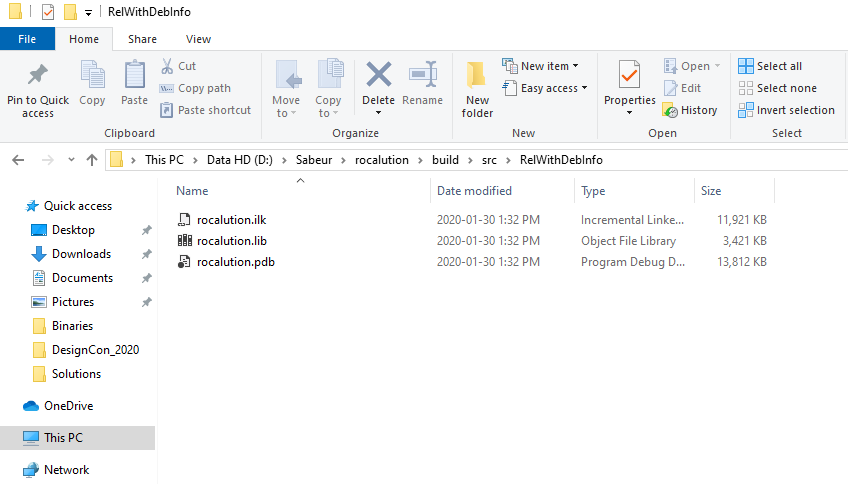<br/>
*Figure 13. Output files for the RelWithDebInfo release*

### Build Debug Version

1. Select "**Debug**" in the configuration dropdown list.
2. Under "**C/C++**" and "**General**" tab, make sure that "**Debug Information Format**" is set to "**Program Database (/Zi)**" (see Figure 12).
3. Under "**C/C++**" and "**Optimization**" tab, make sure that "**Optimization**" is set to "**Disabled (/Od)**" (see Figure 14).

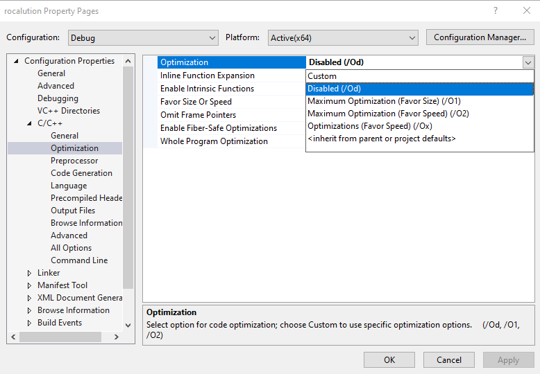<br/>
*Figure 14. Disable optimization for the debug release*

## Resources

* [Rocalution source code on Github](https://github.com/ROCmSoftwarePlatform/rocALUTION)
* [Rocalution documentation](https://rocalution.readthedocs.io/en/master/)

## License

This project is licensed under the MIT License - see the [LICENSE](LICENSE) file for details.
